# Technical Architecture Document

## 1. Application Overview

### 1.1 Purpose

The application is a **patient-first digital health companion**. It gives an individual (and the
family members they look after) a single place to store, understand, and act on their own health
records: prescriptions, lab reports, clinical notes, imaging reports, procedure notes, immunization
records, and billing/insurance documents. A secondary, minimal role lets a **doctor** connect with
a patient (with the patient's approval) and issue prescriptions directly into the patient's record,
but the system is deliberately **not** a clinic, hospital, insurance, or billing platform — those
are explicitly out of scope for the current product phase.

The core value proposition is turning a pile of scanned/photographed paper documents into:

- a searchable, filterable personal archive,
- plain-language AI summaries and structured data extracted from each document,
- a longitudinal health profile (conditions, medications, imaging/procedure/vaccination history)
  computed from that archive,
- automatic medicine reminders derived from prescriptions, and
- a unified chronological timeline of everything that happened to the patient.

### 1.2 High-Level Architecture

The system is a single full-stack web application (server-rendered UI + API in one deployable
unit) backed by a relational database, a local/pluggable file store, and three external AI-adjacent
services that all sit behind one internal gateway:

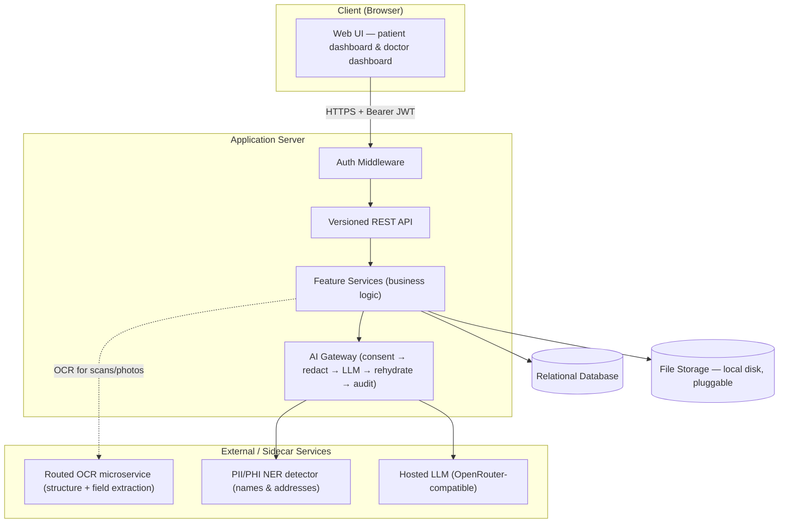

### 1.3 Overall Workflow

1. A patient (or doctor) registers with a mobile number and password, verifies a one-time code, and
   receives a short-lived access token and a longer-lived refresh token.
2. Every subsequent request carries the access token; a middleware layer verifies it once and
   stamps the caller's identity onto the request before it ever reaches business logic.
3. The patient uploads a document (photo or PDF). The system extracts text from it (native PDF text
   layer, or OCR for scans/photos), optionally auto-fills structured metadata using an AI pass, and
   stores the file plus its metadata.
4. On demand, the patient asks the system to "process" a saved document. The document is
   OCR'd once, classified, and routed to a document-family-specific extraction pipeline that asks
   the LLM for both a structured JSON extraction and a plain-language summary — always through the
   AI Gateway, never directly.
5. Every raw OCR pass and every structured extraction is preserved as an immutable, versioned
   history entry (not just overwritten), so nothing is silently lost on re-processing.
6. A read-only aggregation layer recombines all processed records into a longitudinal health
   profile, a chronological timeline, and (for prescriptions) automatically scheduled medicine
   reminders — none of this stores new data of its own; it is computed from what's already saved.
7. A minimal doctor workflow lets a doctor request a connection to a patient, and — once accepted —
   run a daily patient list and write prescriptions that appear immediately in the patient's own
   record and automatically generate that patient's reminders.

---

## 2. Implemented Features

| #   | Feature                                             | Purpose                                                                                                                                                           |
| --- | --------------------------------------------------- | ----------------------------------------------------------------------------------------------------------------------------------------------------------------- |
| 1   | Authentication (patient & doctor)                   | Phone + password/OTP identity, account verification, session issuance                                                                                             |
| 2   | User profile & preferences                          | Personal details, blood group, daily meal-timing routine, AI consent toggle                                                                                       |
| 3   | Family members                                      | Manage dependents so records can be scoped to someone other than the account holder                                                                               |
| 4   | Medical records archive                             | Upload, classify, edit, filter, search, and AI-process any clinical document type                                                                                 |
| 5   | Saved views                                         | Persist a named Medical Records filter combination for one-click reuse                                                                                            |
| 6   | Three-layer document history                        | Immutable original file, immutable raw OCR passes, versioned structured extractions                                                                               |
| 7   | Lab reports                                         | Upload, AI metadata auto-fill, AI summarization, AI structured value extraction                                                                                   |
| 8   | Prescriptions                                       | Patient-entered or doctor-authored medicine records with a structured dose schedule                                                                               |
| 9   | Reminders                                           | Auto-generated medicine reminders from prescriptions, plus manual reminders, with a retry/acknowledgement lifecycle                                               |
| 10  | Timeline                                            | Unified chronological view of the patient's health events                                                                                                         |
| 11  | Patient Intelligence (health profile)               | Read-only longitudinal aggregation: conditions, medication history, imaging/procedure/vaccination histories, episodes, cross-record links, deterministic insights |
| 12  | AI Gateway (summary / extract / analyze / classify) | The single controlled path by which any feature is allowed to call the LLM                                                                                        |
| 13  | OCR pipeline                                        | Turns scans and photos into text (and optionally structured fields) before anything reaches the AI layer                                                          |
| 14  | PII/PHI redaction                                   | Removes identifying information from text before it leaves for the LLM, and restores it afterward                                                                 |
| 15  | Audit logging                                       | Append-only record of every AI operation performed on a user's data                                                                                               |
| 16  | File upload & signed access                         | Stores uploaded documents and mediates all access to them                                                                                                         |
| 17  | Doctor profile                                      | A doctor's professional details (specialization, license, clinic)                                                                                                 |
| 18  | Doctor↔Patient connections                          | Consent-gated linking between a doctor and a patient                                                                                                              |
| 19  | Doctor daily patient list                           | A per-day, tokenized patient queue for a doctor                                                                                                                   |
| 20  | Doctor prescribing                                  | A doctor writes a structured prescription directly into a connected patient's record                                                                              |

Each feature is expanded in detail in **Section 10 (Feature-wise Flow)**.

---

## 3. Application Flow

### 3.1 End-to-End Request Lifecycle

Every private API call follows the same shape, regardless of feature:

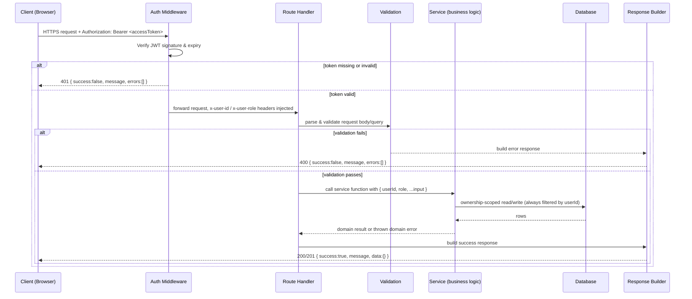

Key structural guarantees this diagram encodes:

- **Authentication happens exactly once, at the edge.** Nothing downstream re-verifies the token;
  it trusts the identity headers the middleware attached.
- **Every response — success or failure — has the same envelope shape.** A caller never has to
  branch on response shape, only on the `success` boolean and HTTP status.
- **Ownership is enforced in the service layer, not the route layer.** Every private read/write is
  scoped by the caller's `userId` (and, where relevant, checks that a referenced `familyMemberId`
  also belongs to that same user).

### 3.2 Authentication and Authorization Flow

Identity is the **mobile phone number** — there is no email-based login. Two account types share
the same tables and token shape: `patient` (default) and `doctor`. A doctor gets an additional
professional profile; both roles otherwise reuse identical session, security, and token machinery.

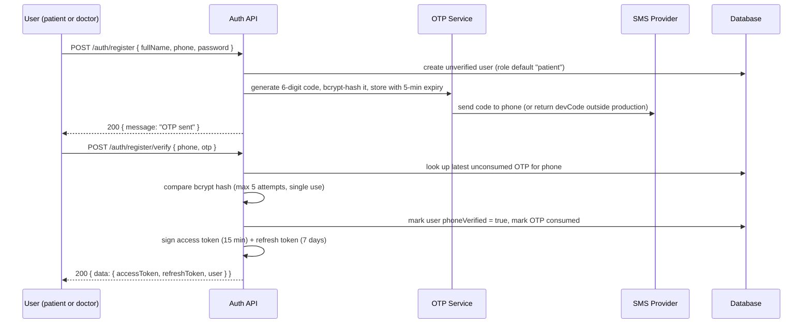

Ongoing session handling:

- **Login** — either `phone + password` in one step, or `phone` → OTP → `phone + otp` in two steps.
- **Token refresh** — `POST /auth/refresh` with a valid refresh token mints a new access/refresh
  pair without re-authenticating with a password.
- **Logout** — invalidates the caller's session context (the token itself remains cryptographically
  valid until it expires; there is no server-side token blacklist in the current design — expiry is
  short, 15 minutes, by design).
- **Authorization** — the JWT carries a `role` claim (`patient` or `doctor`). Doctor-only endpoints
  check this role after the middleware has already verified the token; patient-only data access is
  enforced by `userId` ownership rather than role, since every account (including doctors) is also
  a potential record owner.

**Password and OTP storage.** Passwords are hashed with bcrypt (cost factor 12) before storage —
never stored or logged in plain text. OTP codes are 6 digits, generated with a cryptographically
secure random source (never a general-purpose pseudo-random generator), bcrypt-hashed before
storage, valid for 5 minutes, allow at most 5 incorrect attempts before being killed, are single-use,
and are subject to a 60-second resend cooldown to deter SMS abuse.

### 3.3 Data Processing Flow (documents → structured knowledge)

This is the flow unique to this application: turning an uploaded image or PDF into something a
patient can read and search.

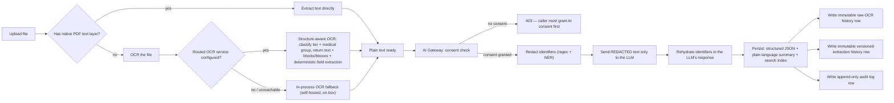

### 3.4 Response Generation Flow

All API responses — success and error alike — are built through two shared helpers so every
endpoint in the system returns byte-for-byte the same envelope shape:

- **Success**: `{ "success": true, "message": "...", "data": { ... } }`
- **Error**: `{ "success": false, "message": "...", "errors": [ ... ] }`

Domain-specific errors (insufficient consent, unparseable AI output, an unreachable AI dependency,
an attempt to delete a system-managed reminder, etc.) are raised as typed errors carrying an HTTP
status code, caught once per route, and rendered through the same error-response builder — so a
caller never sees a bare, unformatted server error for a known failure mode.

---

## 4. Architecture Layers

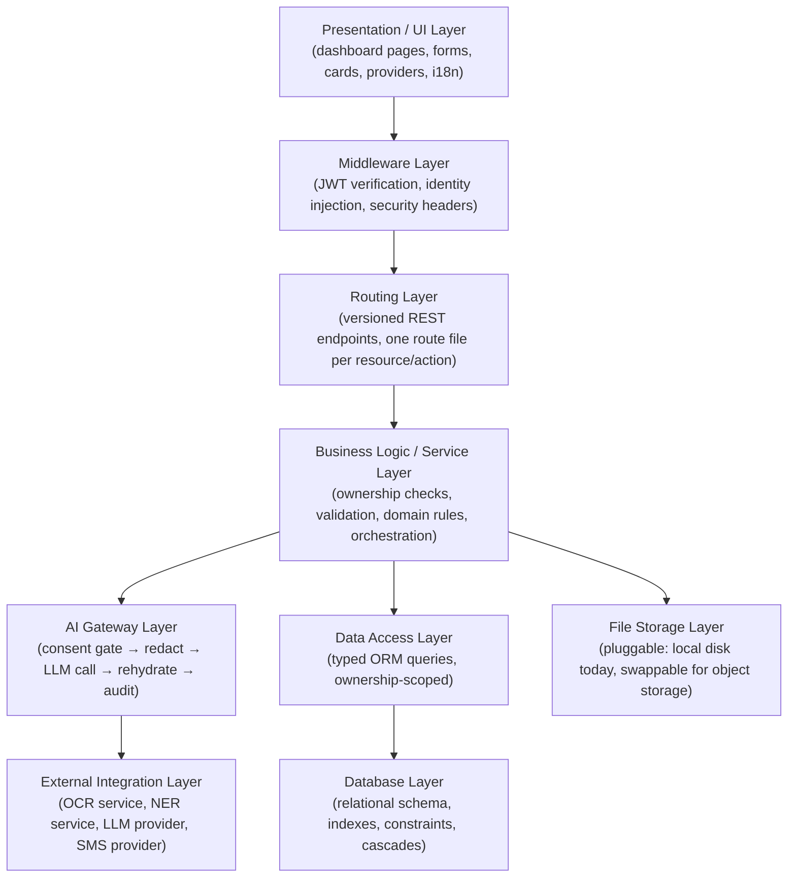

### 4.1 Presentation / UI Layer

A single-page-application-style dashboard (built with a component framework, utility-first CSS,
and a small motion library) renders per-feature pages: dashboard home, family, medical records, lab
reports, prescriptions, reminders, timeline, patient intelligence (health profile), profile, plus a
parallel doctor dashboard (patients, daily patient list/prescribing, my-doctors for the patient
side). Shared concerns — theme (light/dark), language (English/Hindi), and reusable primitives
(buttons, cards, modals, badges) — are centralized so every feature page looks and behaves
consistently. Business logic is deliberately kept out of this layer: pages call the API and render
what comes back; they do not independently decide ownership, validity, or AI eligibility.

### 4.2 Routing Layer

Every API endpoint lives under a single versioned base path. Routes are intentionally **thin
controllers**: parse input, call one service function, format the response. No route file contains
a database query or an AI call directly — everything routes through the service layer described
next.

### 4.3 Middleware Layer

A single middleware runs in front of every request under the versioned API path. It:

1. Allow-lists a short list of endpoints that must be reachable without a token (registration,
   login, refresh — you cannot present a token before you have one).
2. For everything else, requires an `Authorization: Bearer <token>` header, verifies it
   cryptographically, and rejects the request with `401` if it is missing, malformed, or expired.
3. On success, injects the verified caller's user id and role as internal request headers so
   downstream code never needs to re-parse or re-verify the token.

This is the **only** place a token is verified. Every layer below trusts the identity the
middleware attached.

### 4.4 Business Logic / Service Layer

Each feature (medical records, lab reports, prescriptions, reminders, timeline, patient
intelligence, connections, etc.) owns a service module responsible for:

- validating input shape (schema validation library) beyond what basic type-checking gives you,
- enforcing that the resource being read/written belongs to the caller (`userId` match; for
  family-scoped resources, that the referenced family member also belongs to the caller),
- applying domain rules that don't belong in the database (e.g. a prescription-generated reminder
  cannot be deleted by the patient, only completed or dismissed; a doctor cannot delete a
  prescription for a visit date already in the past),
- orchestrating multi-step operations (e.g. "process a medical record" = OCR once, then two AI
  calls, then three separate persistence writes in the correct order).

### 4.5 AI Gateway Layer

Described in full in Section 10.12. The important architectural property: **no other layer is
permitted to call the LLM directly.** This is enforced by convention (a single exported entry
point) rather than by a network boundary, but every AI-touching feature is written to go through
it, which keeps consent-checking, redaction, and audit logging in exactly one place instead of
duplicated per feature.

### 4.6 Data Access Layer

All database access goes through a typed object-relational mapper. Query construction for complex
filtering (e.g. the medical records list's many combinable filters) is centralized into one
exported "build a where-clause" function per feature, so the same filter shape can drive the API,
a saved-filter feature, and (in tests) be exercised without a live database.

### 4.7 Database Layer

A single relational (PostgreSQL) database holds all persistent state. See Section 9 for the full
entity relationship diagram. Referential integrity is enforced at the database level:
cascade-delete on the owning user (deleting an account removes everything it owns) and set-null on
an optional family-member reference (removing a family member un-scopes their records back to the
account holder rather than deleting them). The append-only audit trail deliberately has **no**
foreign key back to the user table, so it survives even account deletion.

### 4.8 External Integrations

| Integration                             | Role                                                                                                                                                         | Failure behavior                                                                                                                                         |
| --------------------------------------- | ------------------------------------------------------------------------------------------------------------------------------------------------------------ | -------------------------------------------------------------------------------------------------------------------------------------------------------- |
| Hosted LLM (OpenAI-compatible API)      | Generates summaries and structured extractions from **already-redacted** text                                                                                | Failure surfaces as a clean, typed "AI service unavailable" error — never a raw exception                                                                |
| PII/PHI name-and-address detector (NER) | Finds free-text identifiers a regex can't (names, addresses)                                                                                                 | **Fails closed**: if configured but unreachable, the whole AI call is refused rather than risk sending an un-redacted name                               |
| Routed OCR microservice (optional)      | Classifies a document's structure/medical category and returns normalized text + layout + deterministic field extraction, without ever calling an LLM itself | Falls back automatically to the in-process OCR engine if unset or unreachable                                                                            |
| SMS provider                            | Delivers OTP codes                                                                                                                                           | In non-production environments, the code is also returned directly in the API response and logged, so the product is testable without a live SMS account |

### 4.9 Background Jobs / Workers

There is **no background job queue or worker process**. All processing — including OCR and both AI
calls in a "process a document" operation — happens synchronously within the HTTP request/response
cycle. This is a deliberate, documented scale choice for a small pilot deployment; a queue is the
first thing to add if a single processing request starts taking too long or volume grows. Two
things that look like background jobs are actually **swept inline on read** instead of running on a
schedule:

- Expired/overdue reminder cleanup (auto-completing reminders past their end date, deleting
  long-completed ones) runs every time the reminders list is fetched.
- The client-side reminder **watcher** polls the reminders endpoint every 30 seconds from the
  browser — this is a UI-driven polling loop, not a server-side background job.

### 4.10 Caching Layer

There is no dedicated caching layer (no Redis or in-memory cache for query results). The closest
analogue is that every AI-derived result (summary text, structured extraction) is **persisted** on
first computation, so re-viewing a previously processed document never re-runs OCR or the LLM — the
saved column/history row acts as a cache in practice, invalidated only by an explicit re-process
action.

### 4.11 Error Handling

Centralized in two places:

1. **Domain error types** — a small set of typed errors (each carrying an HTTP status code) raised
   by service functions for known failure conditions: no AI consent (403), source record not found
   or not owned by the caller (404), AI output that couldn't be parsed (422), the LLM or NER
   dependency being unreachable (502/503), an attempt to delete/edit a system-locked resource (403).
2. **Response builders** — every route catches these typed errors (and, as a last resort, any
   unexpected exception) and renders them through the shared error-response builder, guaranteeing
   the client always receives valid JSON in the standard envelope — never a bare stack trace or an
   empty body.

### 4.12 Logging & Monitoring

- **Audit logging** (application-level, persisted): every AI Gateway call writes one row recording
  who made the call, what action it was, which resource it touched, which model handled it, and how
  many identifiers were redacted. This is a compliance/traceability log, not a debugging log — it is
  append-only and deliberately survives account deletion.
- **Operational logging** (server console): unexpected exceptions (e.g. an LLM call throwing) are
  logged server-side with full detail before being converted into a clean, generic error for the
  client — so operators can diagnose an incident without leaking internals to the caller.
- There is no external monitoring/metrics/tracing integration wired up in the current design.

---

## 5. Routes

All routes are versioned REST endpoints. Every private route enforces two invariants: the caller
must be authenticated (Section 3.2), and the resource returned/mutated must belong to the caller
(directly, or via a family member they own).

### 5.1 Authentication Routes

| Route                          | Purpose                  | Internal flow                                                                                          |
| ------------------------------ | ------------------------ | ------------------------------------------------------------------------------------------------------ |
| `POST /auth/register`          | Create a patient account | Validate phone format + password strength → create unverified user → generate & send OTP               |
| `POST /auth/doctor/register`   | Create a doctor account  | Same as above, plus creates a linked professional profile (specialization/license/clinic)              |
| `POST /auth/register/verify`   | Activate an account      | Validate OTP against stored hash → mark phone verified → issue access + refresh tokens (role included) |
| `POST /auth/login`             | Password login           | Verify phone exists + password hash matches → issue tokens                                             |
| `POST /auth/login/request-otp` | Start OTP login          | Generate & send OTP for an existing, verified phone                                                    |
| `POST /auth/login/verify-otp`  | Complete OTP login       | Validate OTP → issue tokens                                                                            |
| `POST /auth/logout`            | End a session            | Requires a valid access token; clears client-side session state                                        |
| `POST /auth/refresh`           | Rotate tokens            | Validate refresh token → issue a new access + refresh pair                                             |
| `GET /auth/me`                 | Identify the caller      | Requires a valid access token → returns the current user record                                        |

### 5.2 User Profile Routes

| Route                  | Purpose                                 | Internal flow                                                                                                                                                                                 |
| ---------------------- | --------------------------------------- | --------------------------------------------------------------------------------------------------------------------------------------------------------------------------------------------- |
| `GET /users/profile`   | Read the caller's profile               | Returns personal details + whether AI consent is currently granted                                                                                                                            |
| `PATCH /users/profile` | Update profile / consent / meal timings | Merges only the provided fields; setting AI consent stamps a consent timestamp (or clears it); a meal-timing change re-times every not-yet-occurred prescription reminder in the same request |

### 5.3 Family Member Routes

| Route                        | Purpose                      | Internal flow                                                                                                      |
| ---------------------------- | ---------------------------- | ------------------------------------------------------------------------------------------------------------------ |
| `GET /family-members`        | List the caller's dependents | Ownership-scoped list, oldest first                                                                                |
| `POST /family-members`       | Add a dependent              | Creates a record owned by the caller                                                                               |
| `PATCH /family-members/:id`  | Edit a dependent             | Ownership-checked partial update                                                                                   |
| `DELETE /family-members/:id` | Remove a dependent           | Ownership-checked delete; returns 404 (not 403) for a non-owned id, to avoid confirming another user's data exists |

### 5.4 Medical Records Routes

| Route                                              | Purpose                        | Internal flow                                                                                                                                                                                                |
| -------------------------------------------------- | ------------------------------ | ------------------------------------------------------------------------------------------------------------------------------------------------------------------------------------------------------------ |
| `GET /medical-records`                             | List/search/filter records     | Builds a single combined database query from every supplied filter (search text, family member, document type, category, physician/facility, date range, confidence band, processed/unprocessed, sort order) |
| `POST /medical-records`                            | Save a new record              | Persists file reference + metadata; derives a coarse category from the specific document type if not supplied                                                                                                |
| `GET /medical-records/:id`                         | Read one record                | Ownership-checked; resolves the stored file reference to a time-limited signed access URL                                                                                                                    |
| `PATCH /medical-records/:id`                       | Edit record metadata           | Only descriptive fields (title, type, physician, facility, visit date, notes, family member); never touches AI-derived content                                                                               |
| `DELETE /medical-records/:id`                      | Remove a record                | Deletes the stored file (best-effort) and its entire OCR/extraction history                                                                                                                                  |
| `POST /medical-records/:id/process`                | Run AI processing              | OCRs the file once → classifies by document type → dispatches to the matching extraction pipeline → two AI calls (structured data, then summary) → writes three persistence layers (Section 9)               |
| `GET /medical-records/:id/ocr-result`              | Read raw OCR text              | Ownership-checked; the only place raw OCR output is ever exposed                                                                                                                                             |
| `GET /medical-records/:id/versions`                | List extraction history        | Newest-first summary of every past processing pass                                                                                                                                                           |
| `GET /medical-records/:id/versions/:versionNumber` | Read one historical extraction | Full structured data + summary for that specific past version                                                                                                                                                |

### 5.5 Saved Views Routes

| Route                     | Purpose                                | Internal flow                                |
| ------------------------- | -------------------------------------- | -------------------------------------------- |
| `GET /saved-views`        | List the caller's saved filter presets | Ownership-scoped list                        |
| `POST /saved-views`       | Save a filter combination              | Stores a name + the serialized filter object |
| `DELETE /saved-views/:id` | Remove a saved preset                  | Ownership-checked delete                     |

### 5.6 Lab Report Routes

| Route                                              | Purpose                       | Internal flow                                                                              |
| -------------------------------------------------- | ----------------------------- | ------------------------------------------------------------------------------------------ |
| `GET /lab-reports`                                 | List the caller's lab reports | Includes any previously-generated summary/extraction so results show without re-running AI |
| `POST /lab-reports`                                | Save a new lab report         | Persists file reference + optional AI-suggested metadata + original-file metadata          |
| `GET /lab-reports/:id`                             | Read one report               | Ownership-checked; resolves file to a signed URL                                           |
| `DELETE /lab-reports/:id`                          | Remove a report               | Deletes file + its OCR/extraction history                                                  |
| `GET /lab-reports/:id/ocr-result`                  | Read raw OCR text             | Same pattern as medical records                                                            |
| `GET /lab-reports/:id/versions` / `:versionNumber` | Extraction history            | Same pattern as medical records                                                            |

### 5.7 Prescription Routes

| Route                       | Purpose                         | Internal flow                                                              |
| --------------------------- | ------------------------------- | -------------------------------------------------------------------------- |
| `GET /prescriptions`        | List the caller's prescriptions | Includes the prescribing doctor's name when authored by a connected doctor |
| `POST /prescriptions`       | Add a self-entered prescription | Owned by the caller directly                                               |
| `DELETE /prescriptions/:id` | Remove a prescription           | Ownership-checked; cascades to delete its generated reminders              |

### 5.8 Reminder Routes

| Route                   | Purpose                  | Internal flow                                                                                                         |
| ----------------------- | ------------------------ | --------------------------------------------------------------------------------------------------------------------- |
| `GET /reminders`        | List reminders           | As a side effect, auto-completes overdue reminders and purges long-completed ones before returning the list           |
| `POST /reminders`       | Create a manual reminder | Owned by the caller directly                                                                                          |
| `PATCH /reminders/:id`  | Update status / dismiss  | Marking done stamps a completion time; a dismiss action never completes the reminder — it snoozes and retries instead |
| `DELETE /reminders/:id` | Remove a manual reminder | Refused (403) if the reminder was system-generated from a prescription                                                |

### 5.9 Timeline Route

| Route           | Purpose                    | Internal flow                                                                |
| --------------- | -------------------------- | ---------------------------------------------------------------------------- |
| `GET /timeline` | Unified chronological view | Computed/aggregated on read from the caller's records; nothing new is stored |

### 5.10 Patient Intelligence Route

| Route                               | Purpose                     | Internal flow                                                                                                                                                                                                                                              |
| ----------------------------------- | --------------------------- | ---------------------------------------------------------------------------------------------------------------------------------------------------------------------------------------------------------------------------------------------------------- |
| `GET /patient-intelligence/profile` | Longitudinal health profile | Aggregates every processed record's structured extraction on read into conditions, medication history, imaging/procedure/vaccination histories, episodes of care, cross-record links, and deterministic insights — no OCR, no LLM call, nothing new stored |

### 5.11 AI Routes

| Route               | Purpose                                       | Internal flow                                                                                                    |
| ------------------- | --------------------------------------------- | ---------------------------------------------------------------------------------------------------------------- |
| `POST /ai/summary`  | Summarize a saved document                    | Ownership check → AI Gateway → cautious plain-language (or structured, for lab reports) summary → persisted      |
| `POST /ai/extract`  | Extract structured data from a saved document | Same gateway path, asks for strict JSON instead of prose                                                         |
| `POST /ai/analyze`  | Pre-save lab report metadata auto-fill        | Runs on a just-uploaded file before any record exists; returns suggested test name/lab/date + a confidence score |
| `POST /ai/classify` | Pre-save medical record classification        | Same pre-save pattern, but classifies document type and general metadata against the supported-type registry     |

### 5.12 File Upload Route

| Route          | Purpose       | Internal flow                                                                                                                 |
| -------------- | ------------- | ----------------------------------------------------------------------------------------------------------------------------- |
| `POST /upload` | Upload a file | Sanitizes/renames the file, stores it, computes size + content hash, returns a reference for the caller to attach to a record |

### 5.13 Doctor-Side Routes

| Route                                        | Purpose                                | Internal flow                                                                                                                                                                             |
| -------------------------------------------- | -------------------------------------- | ----------------------------------------------------------------------------------------------------------------------------------------------------------------------------------------- |
| `GET` / `PATCH /doctor/profile`              | Read/update professional details       | Doctor-role only                                                                                                                                                                          |
| `GET /connections`                           | List relationships                     | Role-aware: a doctor sees their patients, a patient sees their doctors                                                                                                                    |
| `POST /connections`                          | Request a connection                   | Doctor-only; creates/reopens a pending request by the patient's phone number                                                                                                              |
| `PATCH /connections/:id`                     | Approve/reject a connection            | Patient-only                                                                                                                                                                              |
| `GET /doctor/patients`                       | List accepted patients                 | Doctor-only                                                                                                                                                                               |
| `GET` / `POST /doctor/daily-visits`          | Manage the day's patient queue         | Doctor-only; adding a patient assigns the next sequential token for that day, or returns the existing one if already added                                                                |
| `DELETE /doctor/daily-visits/:id`            | Remove a queue entry                   | Doctor-only                                                                                                                                                                               |
| `GET` / `POST /doctor/prescriptions`         | List / write prescriptions as a doctor | Doctor-only; writing requires an accepted connection; the record is saved under the **patient's** account and appears immediately in their prescriptions list, generating their reminders |
| `PATCH` / `DELETE /doctor/prescriptions/:id` | Edit / remove an authored prescription | Doctor-only, and only for prescriptions the caller themself authored; deletion is refused for a visit date already in the past                                                            |

---

## 6. Connectivity

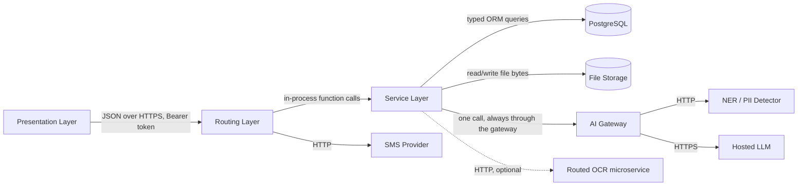

- **UI ↔ Backend**: the browser talks to the API exclusively over versioned JSON REST endpoints,
  authenticated with a bearer access token attached to every request after login. There is no
  server-rendered form posting or session cookie in the current design — the client holds the
  tokens and attaches them explicitly.
- **Backend ↔ Database**: all access goes through a typed ORM layer; no feature ever writes raw
  SQL. Every read/write for a private resource is filtered by the caller's identity at the query
  level, not just checked after the fact.
- **Backend ↔ External APIs**: three outbound integrations exist — the LLM provider, the PII/PHI
  name detector, and (optionally) a routed OCR microservice — plus an SMS provider for OTP
  delivery. All three AI-adjacent integrations are only ever reached through the single AI Gateway
  entry point; no feature service calls them directly.
- **Service-to-Service communication**: within the backend, feature services call each other as
  plain function calls in the same process (e.g. the reminder service is invoked by the
  prescription service when a prescription is created or edited) — there is no internal network hop
  or message broker between features.
- **Event-driven communication**: there is none in the classic sense (no message queue, no pub/sub,
  no webhooks). The closest pattern is the **on-read side effect** — certain read endpoints
  (reminders list, patient intelligence profile, timeline) perform work as a side effect of being
  called (sweeping expired reminders; aggregating records) rather than reacting to an emitted event.

---

## 7. Data Flow

### 7.1 Request → Validation → Business Processing → Database → Response

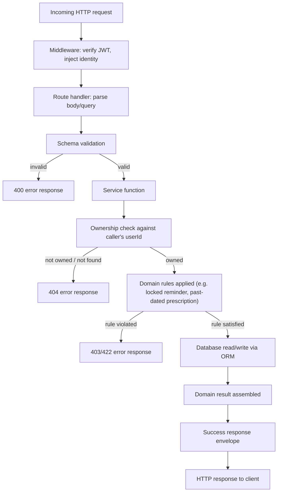

### 7.2 Data Flow Diagram (system-wide)

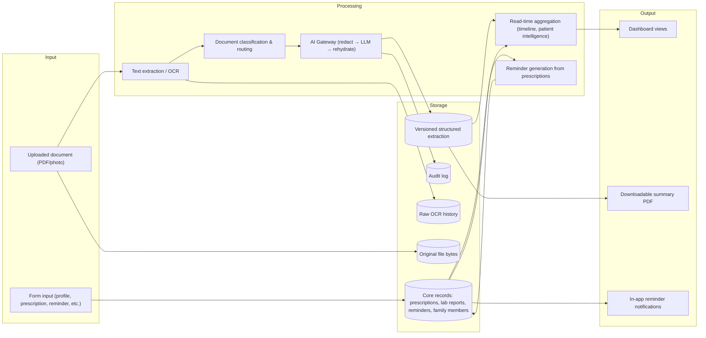

---

## 8. Sequence Diagrams for Major Workflows

### 8.1 Uploading and Processing a Medical Record

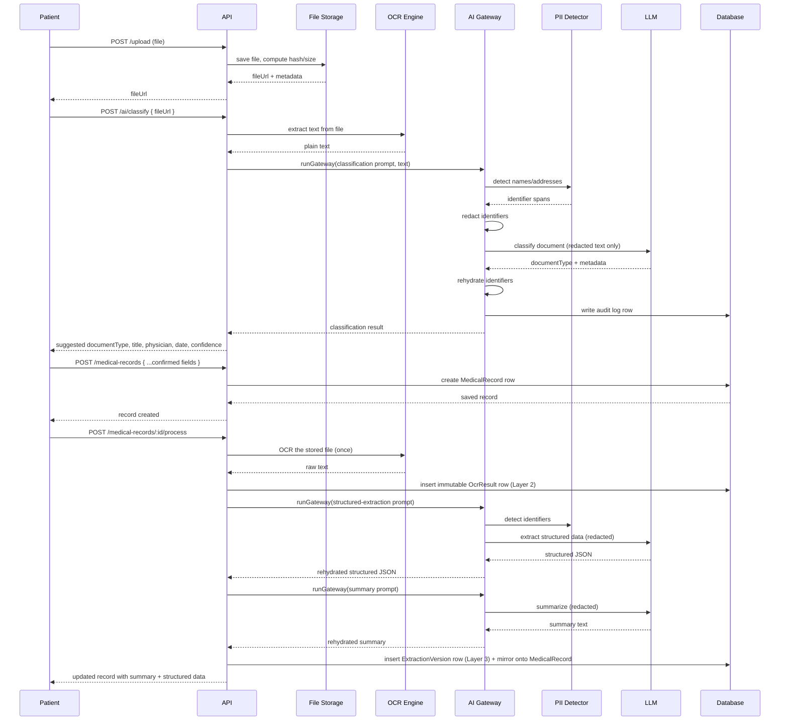

### 8.2 Lab Report AI Summary/Extract Flow

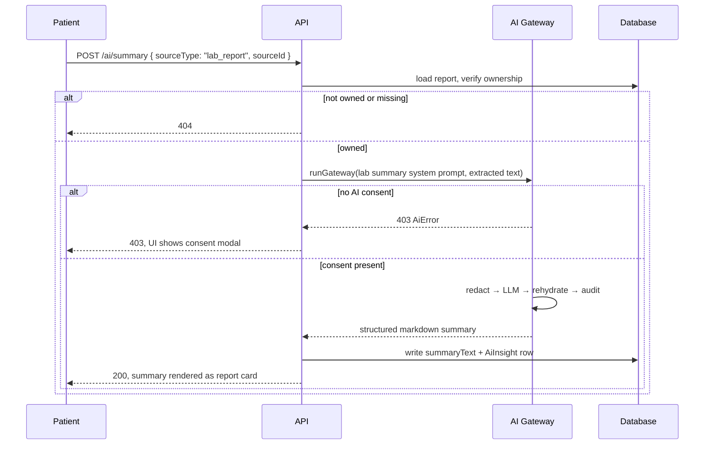

### 8.3 Doctor Prescribing Flow

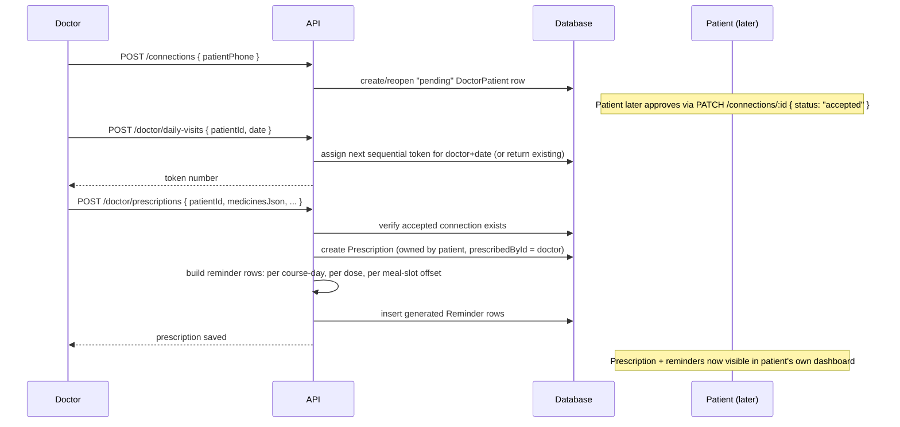

### 8.4 Reminder Lifecycle

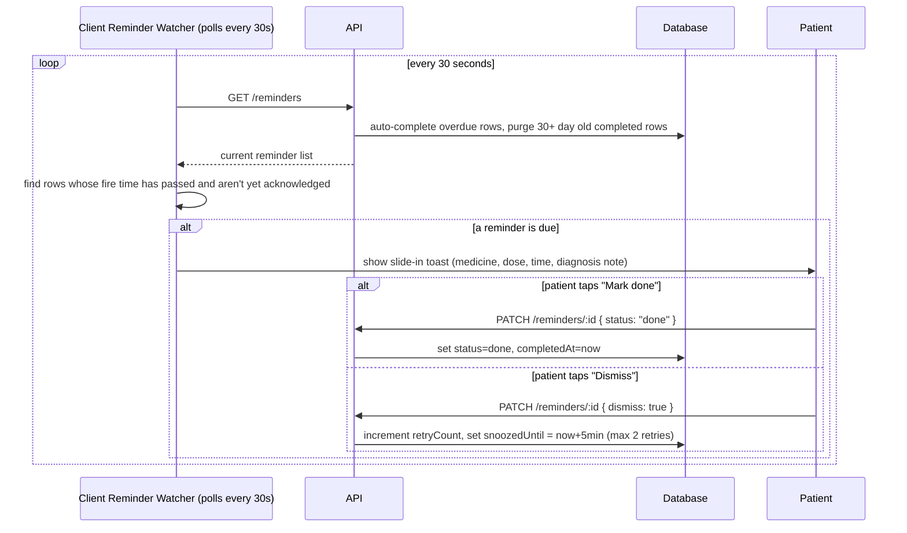

---

## 9. Architecture & Database Diagrams

### 9.1 Component Diagram

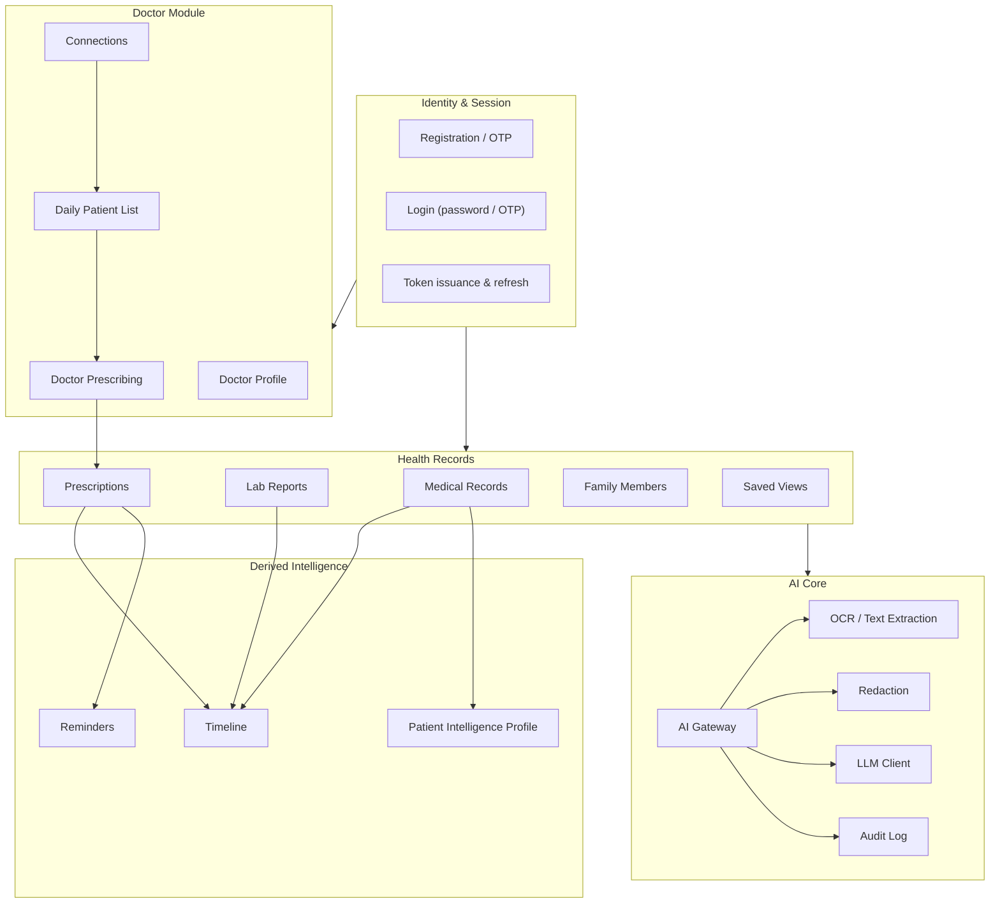

### 9.2 Entity Relationship Diagram

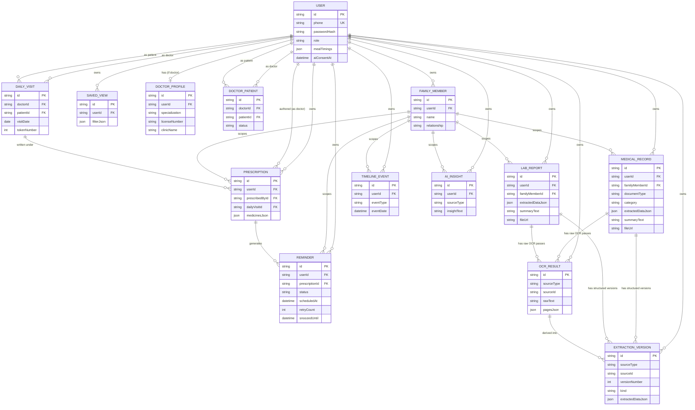

Notable schema-level design decisions:

- Records are always owned by the account holder (`userId`), and **optionally** scoped to a
  dependent (`familyMemberId`). Deleting a family member never deletes their records — it un-scopes
  them back to the account holder (`SetNull`), while deleting the account cascades everything.
  Deliberately re-derived documentation, since this rule shows up identically across five different
  tables.
- Raw OCR output and structured extraction are each their own append-only, versioned table rather
  than columns that get overwritten — every re-processing pass is preserved, not destroyed. The
  "live" summary/extraction columns on the parent record are always a mirror of the _latest_ version
  row, kept for simple reads; full history is reached through the dedicated version endpoints.
- The audit log intentionally has no foreign key to the user table, so it remains a durable
  compliance trail even after an account is deleted.

---

## 10. Feature-Wise Flow

### 10.1 Authentication

- **Entry point**: registration or login form submission.
- **Processing steps**: validate phone format and password strength → (registration) create an
  unverified account and issue an OTP, or (login) verify credentials directly.
- **Services involved**: the auth service, the OTP service, the SMS provider abstraction.
- **Business logic**: OTPs are single-use, time-boxed, attempt-limited, and rate-limited on resend;
  passwords and OTPs are one-way hashed, never stored or compared in plain text.
- **Data interactions**: creates/reads the account table and the OTP table.
- **Final output**: an access token (15-minute lifetime) and a refresh token (7-day lifetime), both
  carrying the caller's role.

### 10.2 User Profile & Meal-Timing Preferences

- **Entry point**: the profile page, or the optional post-registration onboarding step.
- **Processing steps**: partial update of personal fields; a meal-timing change additionally
  triggers a re-scheduling pass over every not-yet-occurred, prescription-generated reminder.
- **Services involved**: the user profile service, the reminder rescheduling routine.
- **Business logic**: only the four scheduling-relevant meal keys (breakfast/lunch/high
  tea/dinner) affect reminder timing; wake-up/bedtime are stored for display only. A change never
  rewrites reminders already in the past.
- **Data interactions**: updates the user record; conditionally updates reminder rows dated
  tomorrow or later.
- **Final output**: the updated profile, and (silently) re-timed future reminders.

### 10.3 Family Members

- **Entry point**: the family page.
- **Processing steps**: standard create/read/update/delete, always scoped to the caller.
- **Business logic**: deletion of a non-owned id returns "not found" rather than "forbidden", to
  avoid confirming the existence of another user's data.
- **Data interactions**: the family member table; referenced (optionally) by every other
  record-owning table.
- **Final output**: a family member usable as a scoping option on every other feature's forms.

### 10.4 Medical Records Archive

- **Entry point**: uploading a document on the medical records page.
- **Processing steps**: upload → (optional) AI classification for auto-fill → save →
  (on demand) AI processing → filtering/search/editing.
- **Services involved**: file storage, text extraction/OCR, the AI Gateway, the per-document-family
  extraction pipeline (clinical, medication, imaging, procedure, immunization, billing), the
  filtering/search query builder.
- **Business logic**: the specific document type drives which extraction pipeline runs; a coarse
  category is derived automatically when not explicitly given; editing a record can only touch
  descriptive metadata, never AI-derived content (that only changes via re-processing).
- **Data interactions**: writes the record itself, an immutable raw-OCR row, and an immutable
  versioned-extraction row per processing pass; the record's own summary/extraction columns always
  mirror the latest version.
- **Final output**: a searchable record with a patient-friendly summary, structured data, and a
  full processing history.

### 10.5 Saved Views

- **Entry point**: "Save this filter" action on the medical records list.
- **Processing steps**: persist the current filter combination under a name.
- **Business logic**: the stored filter object is treated as a client-supplied snapshot, not a
  trusted query — only recognized filter keys are ever read back out of it.
- **Final output**: a one-click filter shortcut in the sidebar.

### 10.6 Lab Reports

- **Entry point**: uploading a lab report file (including a phone-camera photo).
- **Processing steps**: upload → AI metadata auto-fill (before saving) → save → (on demand)
  summarize and/or extract structured values.
- **Business logic**: a lab-report summary is always structured markdown with fixed sections
  (Overall Summary / Key Findings / Abnormal Results / Normal Results / Follow-up); extraction
  yields one row per test value with reference range and flag.
- **Data interactions**: same three-layer persistence pattern as medical records (original file,
  raw OCR history, versioned extraction history), plus a mirrored summary/extraction column for
  simple reads.
- **Final output**: a tabbed report view (AI Summary / Lab Values), a downloadable PDF summary, and
  a searchable values table.

### 10.7 Prescriptions

- **Entry point**: a patient adding their own prescription, or a doctor prescribing to a connected
  patient.
- **Processing steps**: save the prescription; if it carries a structured dose schedule and a
  quantity, generate the full set of individual reminder instances for the whole course up front.
- **Business logic**: reminders are pre-generated per course-day per dose (not a single repeating
  reminder); a schedule never places a reminder in the past — a partially-elapsed day shifts the
  whole course forward without losing a dose.
- **Data interactions**: the prescription row, plus one reminder row per course-day per dose.
- **Final output**: the prescription in the patient's list, and a fully scheduled set of medicine
  reminders with no further action needed.

### 10.8 Reminders

- **Entry point**: automatic (from a prescription) or manual (patient-created).
- **Processing steps**: a client-side watcher polls the reminder list; a due, unacknowledged
  reminder surfaces as an in-app notification with Mark-done/Dismiss actions.
- **Business logic**: dismissing a reminder never completes it — it snoozes and retries (up to a
  fixed retry count) so a medicine dose can never be silently skipped; system-generated (prescription)
  reminders cannot be edited or deleted by the patient, only completed or dismissed once due;
  completed reminders are purged automatically after a 30-day retention window.
- **Data interactions**: reads/writes the reminder table; the retention sweep and auto-completion
  run inline on every list read rather than on a schedule.
- **Final output**: a three-bucket (Active / Upcoming / Completed) reminder list and real-time
  in-app notifications.

### 10.9 Timeline

- **Entry point**: opening the timeline page.
- **Processing steps**: aggregate the caller's records into one chronological feed on read.
- **Business logic**: purely a read-time computation; nothing new is stored.
- **Final output**: a single chronological history of the patient's health events.

### 10.10 Patient Intelligence (Health Profile)

- **Entry point**: opening the health profile page.
- **Processing steps**: read every processed record's structured extraction → bucket by clinical
  kind (not just coarse category) → build condition timelines, a cross-record medication status
  timeline, grouped imaging/procedure/vaccination histories, deterministic episodes (time+entity
  clustering), deterministic cross-record links, and deterministic observations.
- **Business logic**: every item is labeled either a documented **fact** (read straight from a
  structured extraction) or a computed **pattern** (derived here), so the patient can tell the
  difference. No OCR and no LLM call happens in this feature at all — it is a pure aggregation over
  data already produced by the medical records processing pipeline.
- **Data interactions**: read-only; queries the same record store medical records already populate.
- **Final output**: a longitudinal health profile, re-computed fresh on every request, that scopes
  to the selected family member exactly like every other feature.

### 10.11 Doctor Module (Profile, Connections, Daily List, Prescribing)

- **Entry point**: a doctor's dashboard.
- **Processing steps**: register as a doctor → request a connection to a patient by phone number →
  patient approves/rejects → doctor adds the patient to a day's list (assigned a sequential token) →
  doctor writes a structured prescription → reminders generate automatically for the patient.
- **Business logic**: a connection must be explicitly accepted before any prescribing is possible;
  each side of a connection only ever sees their own relationships; prescribing is additive (never
  overwrites an earlier prescription for the same visit); a doctor can only edit/delete their own
  authored prescriptions, and never delete one for a visit date already in the past.
- **Data interactions**: connection table, daily-list table, prescription table (with a pointer to
  the authoring doctor and the daily-list entry), cascading into the reminder table.
- **Final output**: a prescription that appears immediately in the patient's own dashboard, fully
  scheduled with reminders, without the patient having entered anything themselves.

### 10.12 AI Gateway (the shared engine behind every AI feature)

- **Entry point**: any feature calling the single gateway function with the caller's id, an action
  name, a source reference, a system prompt, and the text to process.
- **Processing steps, in strict order**:
  1. **Consent gate** — refuses with a clear error unless the caller has explicitly granted AI
     processing consent; nothing below this line ever executes without it.
  2. **Redaction** — direct identifiers (email, PAN, ABHA-style health ID, Aadhaar-shaped numbers,
     Indian mobile numbers, dates) are removed by pattern matching; names and addresses are removed
     by a dedicated free-text detection service. Clinical content — values, diagnoses, findings — is
     deliberately **kept**, since that's the substance being analyzed; only identifiers are stripped.
     If the name/address detector is configured but unreachable, the call is refused outright rather
     than risk a name reaching the model unredacted.
  3. **LLM call** — only the redacted text is sent to the model.
  4. **Rehydration** — placeholders in the model's response are swapped back for the original
     identifiers before the result is shown to the user.
  5. **Audit** — one append-only log row is written per call, recording the action, the resource,
     the model used, and how many identifiers were redacted.
- **Business logic**: this is the **only** path by which any feature is allowed to reach the LLM —
  every AI-touching feature routes through it rather than calling the model independently, which is
  what makes consent-checking, redaction, and audit logging consistent and impossible to
  accidentally bypass.
- **Data interactions**: reads the caller's consent flag; writes one audit row per call. The
  identifier map built during redaction lives only in memory for the duration of the call and is
  never persisted.
- **Final output**: a cautious, identifier-restored AI response, plus a durable audit trail entry.

### 10.13 OCR / Text Extraction

- **Entry point**: any time a feature needs the text content of an uploaded file.
- **Processing steps**: if the file is a PDF with a native text layer, extract it directly (no
  OCR needed); otherwise OCR it. OCR first tries an optional, separately-deployed structure-aware
  OCR service that classifies the document's structure/medical category and returns normalized text
  plus layout and deterministic field extraction (without ever calling an LLM itself); if that
  service isn't configured or isn't reachable, an in-process, self-hosted OCR engine handles it
  instead (bilingual, tuned for this project's document mix), with images normalized (grayscale,
  upscaled) before recognition and image-only PDFs rasterized page by page first.
- **Business logic**: OCR output is treated as ordinary text from this point on — it flows through
  the same redaction gateway as any other extracted text before anything reaches the LLM, since
  pixels can't be pre-redacted before they're read.
- **Final output**: plain text (and, when the structure-aware path ran, layout/blocks and
  deterministic field candidates) ready for classification, extraction, or summarization.

### 10.14 File Upload & Signed Access

- **Entry point**: any file picker across the app (medical records, lab reports, prescription
  attachments).
- **Processing steps**: the uploaded file is renamed to a random, unguessable name (never the
  user's original filename) before being stored; its size and a content hash are computed and kept
  as metadata alongside the original filename for reference. Reading a stored file back always goes
  through a signed-access resolution step rather than exposing the storage path directly.
- **Business logic**: storage is implemented as a pluggable interface — local disk in the current
  deployment — so the same calling code would work unchanged against an object-storage backend
  later; only the storage implementation itself would need to change.
- **Final output**: a stored file plus a time-limited access reference, never a raw, permanently
  guessable file path.

---

## 11. Dependencies Between Components

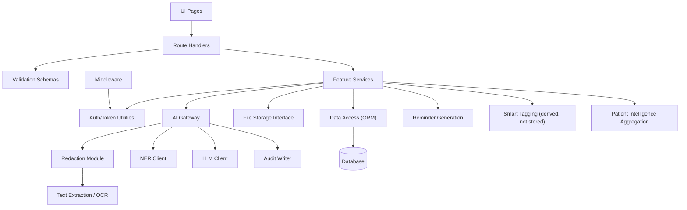

- The **middleware** depends only on the token utilities — it has no knowledge of any feature.
- **Feature services** depend on the data access layer, the file storage interface, and (only for
  AI-touching features) the AI Gateway — never on each other's internals directly, except where a
  feature explicitly triggers another (prescription creation triggers reminder generation; the
  medical records processing pipeline is what patient intelligence reads from).
- **Smart tags** and **patient intelligence** are pure derived views: they depend on already-stored
  structured extractions and add no new dependency of their own (no OCR, no LLM, no new table).
  This is a deliberate layering choice — derived/read-time features only ever depend downward on
  already-persisted data, never sideways on another derived feature or upward on the AI pipeline
  directly.
- The **AI Gateway** is a strict choke point: redaction, the NER client, and the LLM client are only
  ever reached through it, never imported directly by a feature service.

---

## 12. Error Handling

### 12.1 Validation Flow

Every mutating endpoint validates its input body/query against a schema before any business logic
runs. A validation failure short-circuits immediately with a `400` and a list of specific error
messages — no partial processing ever happens on invalid input.

### 12.2 Exception Handling

Two categories of failure are handled differently:

1. **Expected domain failures** (no consent, not found, not owned, a locked resource, an
   unparseable AI response, an unreachable AI dependency) are raised as typed errors carrying the
   correct HTTP status code and a user-safe message. These are anticipated and handled explicitly.
2. **Unexpected failures** (anything else — a dependency throwing an unfamiliar exception) are
   caught at the route boundary, logged in full server-side for diagnosis, and converted into a
   generic `500` response — the caller never receives a raw stack trace or an unhandled crash.

### 12.3 Error Propagation

Errors propagate upward from the data access layer through the service layer to the route handler
as thrown exceptions (never as silent `null`/`undefined` returns for a failure case), guaranteeing a
single place — the route handler — decides how to render every possible outcome.

### 12.4 Error Responses

Every error, regardless of source, is rendered through the same builder into:

```json
{ "success": false, "message": "human-readable explanation", "errors": ["optional detail", "..."] }
```

with an HTTP status that reflects the actual failure mode (`400` invalid input, `401` unauthenticated,
`403` forbidden/consent/locked-resource, `404` not found/not owned, `422` unparseable AI output,
`502` LLM unavailable, `503` PII detector unavailable, `500` unexpected).

---

## 13. Security

### 13.1 Authentication

Phone-number identity, password (bcrypt-hashed, cost 12) or OTP-based login, short-lived (15-minute)
signed access tokens and longer-lived (7-day) signed refresh tokens, each carrying the subject id,
phone, and role.

### 13.2 Authorization

Role (`patient`/`doctor`) is carried in the token and checked on role-specific endpoints (doctor
profile, connections, daily list, doctor-authored prescriptions). Resource-level authorization —
the far more common case — is enforced by strict ownership checks (`userId` match) on every private
read and write, independent of role.

### 13.3 Token / Session Handling

Tokens are verified exactly once, at the middleware layer, before any route logic runs; the verified
identity is passed downstream via internal request headers so nothing re-parses the token. Refresh
tokens allow silent re-authentication without re-entering a password. There is currently no
server-side token revocation list — session termination relies on short access-token expiry plus
client-side token disposal on logout. Tokens are currently held in browser storage on the client,
which is a known, documented pre-production hardening item (a migration to an httpOnly cookie is the
identified next step).

### 13.4 Access Control

- Every private resource query is filtered by the caller's identity at the data-access layer, not
  merely checked in application code after the fact.
- Deleting a resource that doesn't belong to the caller returns "not found" rather than "forbidden"
  in places where revealing existence would itself leak information (e.g. family members).
- System-generated resources (prescription-derived reminders) are further locked against edit/delete
  by the owning patient themselves — only specific state transitions (mark done, dismiss) are
  permitted.
- A doctor can only act on prescriptions they themselves authored, and only while connected
  ("accepted" status) to the patient in question.

### 13.5 Input Validation

All mutating request bodies are validated against explicit schemas (types, formats, and value
constraints) before reaching business logic. Date fields accept a constrained, explicitly-validated
format rather than an unbounded string.

### 13.6 Security Measures Implemented

- **HTTP security headers** on every response: strict-transport-security, no-sniff, deny-framing,
  a restrictive referrer policy, and a permissions policy denying camera/microphone/geolocation
  access by default.
- **Centralized secret/environment validation**, run both at process boot (so a misconfigured
  production deployment fails immediately rather than on first request) and at the point of use; in
  production, placeholder or too-short secrets are explicitly rejected rather than silently accepted.
- **One-way hashing** for both passwords and OTP codes — neither is ever stored, logged, or compared
  in plain text.
- **Reversible-but-ephemeral PII redaction**: identifiers are never sent to the external LLM; the
  mapping used to restore them afterward exists only in memory for the duration of a single request
  and is never persisted anywhere.
- **Fail-closed AI dependency**: if the name/address detector is configured but unreachable, the
  entire AI operation is refused rather than silently skipping that protection.
- **Append-only audit trail** of every AI operation, deliberately decoupled from the user table so
  it survives account deletion — an intentional compliance/traceability design choice.
- **No raw file paths exposed to the client** — every file read goes through a signed-access
  resolution step, keeping the storage layer swappable and access time-limited.
- **Known, documented gaps** (explicitly tracked, not accidental): uploaded files and health data
  are not yet encrypted at rest; access tokens currently live in browser storage rather than an
  httpOnly cookie; there is no distributed rate limiting beyond the OTP resend cooldown. These are
  scoped, intentional trade-offs for the current pilot stage rather than oversights.

---

## 14. Overall Execution Flow

Putting every layer together, a single representative user journey — a patient photographing a lab
report and getting an AI summary — touches the system as follows:

1. The patient authenticates (phone + password/OTP), receiving an access token that every
   subsequent request will carry.
2. The patient photographs a lab report in the browser/mobile camera flow; the image is uploaded,
   stored under a random filename, and its size/hash captured.
3. Before saving anything as a "record," the app asks the AI layer to pre-fill metadata: the image
   is OCR'd, the resulting text passes through the consent gate and redaction, a redacted prompt
   goes to the LLM, and the (identifier-restored) suggested test name/lab/date come back with a
   confidence score for the patient to confirm or correct.
4. The patient confirms the details; a lab report record is created, referencing the stored file and
   the confirmed metadata.
5. The patient taps "Summarize." The system loads the report (ownership-checked), extracts its text
   again, and runs it through the same AI Gateway: consent check → redact → LLM (asked for a
   structured markdown summary this time) → rehydrate → persist the summary and log the operation.
6. The summary is rendered as a tabbed report card (summary / extracted values), downloadable as a
   formatted PDF, and — because it was persisted — available instantly on every future visit without
   re-running the AI.
7. Independently of any explicit action, this newly processed report immediately contributes to the
   patient's Timeline (a chronological entry) and Patient Intelligence profile (e.g. a new lab value
   feeding a condition or medication timeline) the next time either page is opened — both are
   computed fresh from stored data, not separately maintained.
8. If the report happened to originate from a prescription rather than a lab report, an equivalent
   flow would additionally have generated a full set of medicine reminders at creation time, which a
   client-side watcher would begin surfacing as in-app notifications once their scheduled time
   arrives — with a dismiss-and-retry safety net ensuring a dose is never silently forgotten.

At every step, the same guarantees hold: the caller's identity is verified exactly once at the edge,
every resource access is scoped to that identity, every AI call passes through one gateway with
consent-gating and identifier redaction, every response — success or failure — has the same
predictable shape, and every AI operation leaves a durable, user-independent audit trail.
